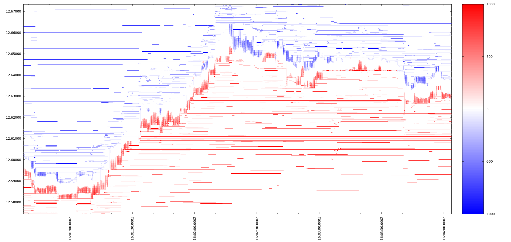

# MArket LIquidity (MALI)

A stand-alone application for the transformation of the reconstructed order book events into a format suitable for a visualisation of market liquidity by [gnuplot](http://gnuplot.info/) or a similar application. An example of the visualisation is shown below:

## Installation

The installation instructions are for Debian 10.

1. Install BOUML v7.10 or later as described [here](https://www.bouml.fr/download.html).

2. Install C++ Tool chain, Boost and Qmake:

       apt install clang-10
       apt install libboost-dev  libboost-system-dev libboost-thread-dev libboost-log-dev libboost-program-  options-dev
       apt install qt4-qmake

3. Launch BOUML and open `mali/mali.prj` project       
4. Generate C++ code for 'mali' and `.pro` file for `<executable>mali`. The code and .pro file will be generated in `/tmp/mali/cpp` folder.

5. Make `/tmp/mali/build` folder and build the application:

       mkdir /tmp/mali/build
       cd /tmp/mali/build
       qmake ../cpp/mali.pro
       make

## Usage

    ./mali input-file-1 [input-file-2 ... input-file-N]

where `input-file-X` is a file containing reconstructed order book events (as produced by [OBERON](https://github.com/petr-fedorov/oberon)).

The program will output the following five files with self-explanatory names:
* `best_bids.csv`
* `best_asks.csv`
* `bids.csv`
* `asks.csv`
* `trades.csv`

Remove or rename `trades.csv` if you don't want to visualise trades.

Then launch gnuplot and enter the following commands:

    load ../cpp/mali.gp
    # adjust the price range below as needed
    set yrange [15200:15800]
    replot
